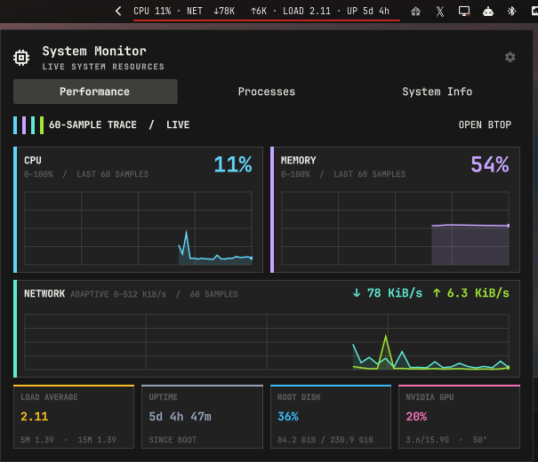
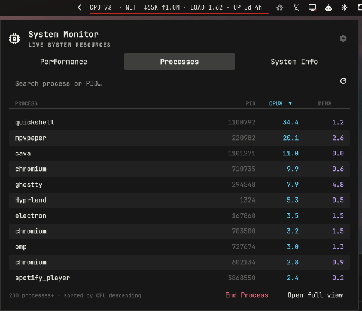
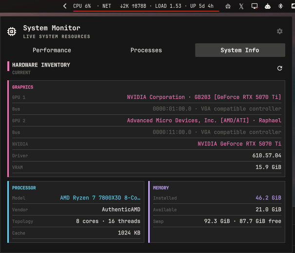
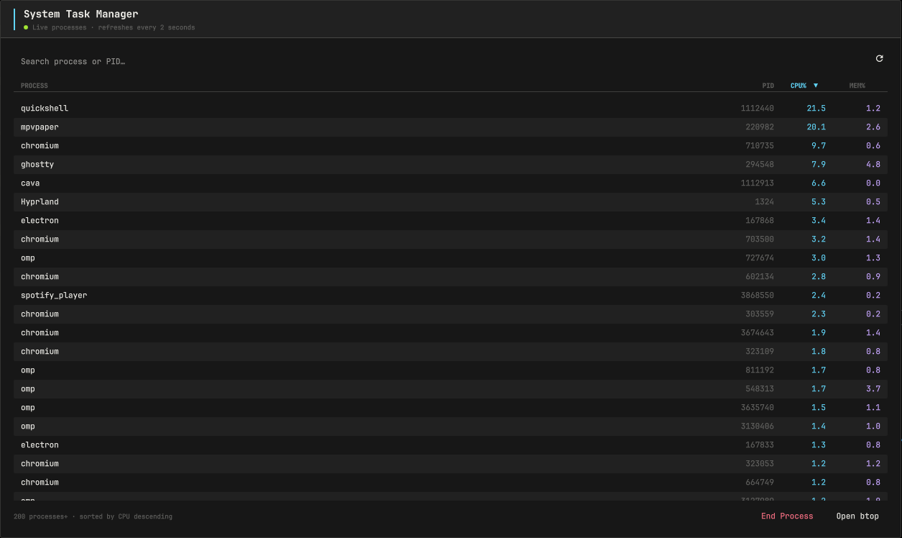

# Omarchy System Monitor

A live system monitor for the [Omarchy](https://omarchy.org) shell: a configurable
resource chip in your bar, a three-tab overview panel, and a standalone Task
Manager window — with race-free, identity-verified process termination.

| Panel — Performance | Panel — Processes |
|:---:|:---:|
|  |  |

| Panel — System Info | Task Manager window |
|:---:|:---:|
|  |  |

## Features

| Area | What you get |
|---|---|
| Bar chip | CPU, memory, network, load, and uptime at a glance — plus any temperature or fan sensor you pin to it. Two styles: animated instrument gauges or compact minimal text. |
| Panel | Click the chip for a popover with **Performance**, **Processes**, and **System Info** tabs. |
| Performance | Live CPU/memory history graphs, a dual-direction network graph, load averages, uptime, root-disk usage, and (on NVIDIA) GPU utilization, VRAM, and temperature. Sensor cards for every monitor pinned to the chip. |
| Processes | A live, searchable, sortable table of your own processes — filter as you type, sort by CPU, memory, or name. |
| Task Manager | A large standalone window (1100×720) with the same table and full keyboard navigation. Reopening focuses the existing window instead of stacking a second one. |
| System Info | Hardware inventory from unprivileged sources: processor topology, memory and swap, motherboard/BIOS, OS and kernel, and display adapters. |
| Settings | Per-bar chip configuration with live preview — pick the chip style and exactly which monitors it shows. |
| Safety | Monitoring probes and process termination use argv-only execution, and every probe's output is capped at the producer before it reaches the shell. *End Process* sends SIGTERM only after the target's identity is re-verified through a kernel pidfd — a reused PID can never be signalled. |

## Requirements

- [Omarchy](https://omarchy.org) (Hyprland + the omarchy-shell Quickshell environment)
- Linux 5.3 or newer and system Python 3.9 or newer for the *End Process*
  pidfd APIs — both already present on an Omarchy install; the plugin is
  fully architecture-independent

## Installation

```sh
omarchy plugin add https://github.com/rmacy/omarchy-system-monitor --enable
```

The plugin appears as the **System Monitor** chip on the right side of your bar.

### Updating and removal

```sh
omarchy plugin update bitr0t.system-monitor   # pull the latest revision
omarchy plugin remove bitr0t.system-monitor   # uninstall
```

## Using it

### The bar chip

- **Left-click** — open the System Monitor panel
- **Middle-click** — launch (or focus) `btop` in a terminal
- **Right-click** — open the Task Manager window

Hovering the chip shows current CPU, memory, and network rates.

### The panel

The panel has three tabs, cycled with <kbd>Ctrl+Tab</kbd> / <kbd>Ctrl+Shift+Tab</kbd>:

- **Performance** — utilization graphs, network traffic, load, uptime, disk, GPU, and your pinned sensor cards.
- **Processes** — your processes, refreshed every 2 s while the tab is visible. Type to filter, click a column header to sort, select a row and press *End Process*. The footer can hand off to `btop` or open the full Task Manager.
- **System Info** — the hardware inventory described above, with a refresh button.

The gear button in the panel header opens chip settings.

### The Task Manager

Right-click the chip, choose *Open full view* from the Processes tab, or bind it
globally in your Hyprland config:

```ini
bind = CTRL SHIFT, ESCAPE, exec, omarchy-shell bitr0t.system-monitor taskManager
```

That gives you a Windows-style <kbd>Ctrl+Shift+Esc</kbd> task manager that opens
— or focuses — the window from anywhere.

### Chip settings

Open with the gear in the panel header. Changes apply immediately and are saved
when the panel closes.

**Chip style**

| Style | Look |
|---|---|
| Instrument (default) | Color-coded gauges with sparkline motion — CPU/memory fill, a live traffic graph, threshold-aware sensor colors |
| Minimal | Compact monochrome text (`CPU 42%  MEM 61%  NET ↓1.2M ↑96K`) |

**Monitors**

| Monitor | Shows |
|---|---|
| CPU | Utilization percentage + sparkline |
| Memory | Used percentage + sparkline |
| Network | Download/upload rates + traffic graph |
| Load | 1-minute load average |
| Uptime | Compact time since boot (`2d 5h`) |
| Temperature / Fan sensors | Any reading from `sensors -j` — e.g. CPU `Tctl` or a pump fan — pinned to the chip; temperatures turn warning/critical at the thresholds lm-sensors reports |

Sensor monitors survive hotplug churn: a docked sensor keeps its selection and
label while temporarily absent, and turns itself off when you remove it.

## Optional dependencies

Core readings (CPU, memory, network, load, uptime, process list, hardware
inventory) use only `/proc`, `ps`, `awk`, `df`, and `uname` — all present on an
Omarchy install. Everything else degrades gracefully when its command is
missing:

| Arch package | Command | Unlocks |
|---|---|---|
| `lm-sensors` | `sensors` | Temperature and fan monitors (chip + performance sensor cards) |
| `btop` | `btop` | Middle-click terminal monitor |
| `nvidia-utils` | `nvidia-smi` | GPU utilization/VRAM/temperature readouts and NVIDIA details on System Info (other GPUs still appear via the PCI inventory) |
| `pciutils` | `lspci` | Display-adapter inventory on the System Info tab |

## Ending processes safely

*End Process* is built so the process you confirmed is the process that gets
the signal:

1. **No shell in the data path.** Monitoring probes — `ps`, `sensors`, `df`,
   `nvidia-smi` — and the termination helper are launched as argv lists.
   Nothing typed into the search box can reach a shell. The separate `btop`
   shortcut passes one fixed command to Omarchy's host launcher.
2. **Your processes only.** The list runs `ps` for your own user; the helper
   sends `SIGTERM` (graceful termination), not `SIGKILL`.
3. **Selections carry identity.** Each row captures the process's `lstart`
   birth token. Every refresh reconciles your selection against PID *and*
   token, so an exited process — or a reused PID — can never remain the kill
   target.
4. **Identity is re-verified at signal time.** The residual race in
   validate-then-kill designs is the gap between reading a PID's identity and
   signalling it: the process can exit and its PID be handed to a different
   program. The `pidfd-signal` helper closes that gap by pinning the process
   with a **pidfd** first. From that moment, the descriptor refers to exactly
   one process and no reuse can swap it; it then
   re-derives the birth time from kernel truth (`/proc/PID/stat` field 22 +
   `/proc/stat` btime) and compares it with the token captured at selection.
   Only an exact match is signalled, through the pidfd.
5. **Probe output is bounded at the producer.** Every external monitoring
   command runs through `bin/bounded-command`, which caps the complete
   output before any QML collector starts buffering — memory safety never
   rests on parser-side limits alone.

The helper reports honestly: exit 0 means the confirmed process was signalled;
exit 3 (vanished) or 4 (identity mismatch — the PID now names a different
process) clears the selection and asks you to confirm again. An identity
failure is never reported as success. The helper also takes argv only and
rejects any argument beginning with `-`, so it cannot be turned into an option
injection.

### Bounded probe output

`bin/bounded-command` is a second source-only helper built the same way as
the pidfd script: plain standard-library Python behind a
`#!/usr/bin/python3` shebang, with no shell, temporary files, build step,
or dependency — nothing to compile or install, and the source at the
installed path is exactly what runs. Every external monitoring probe is
launched through it, wrapping the complete producer argv (`shell=False`)
so the bound is enforced on the producer side, before a QML
`StdioCollector` ever begins buffering:

- **Bounded buffering.** The wrapper buffers up to the probe's configured
  cap plus one sentinel byte used only to detect overflow — never more than
  the hard 8 MiB maximum plus that sentinel — so a runaway producer cannot
  grow plugin memory without limit.
- **Success-only delivery.** The bounded output is handed to QML only when
  the producer exits 0; a failed probe delivers nothing.
- **Overflow kills the producer group.** A producer that exceeds its cap
  is killed together with descendants that remain in its process group,
  and the wrapper emits only a fixed, size-limited diagnostic — never the
  partial data.
- **Fixed stderr.** The producer's stderr is discarded, so diagnostics can
  never become an unbounded second channel.

Caps match the largest sane output per probe: the process table is capped
at 2 MiB, `sensors` and `lspci` at 1 MiB each, and the smaller fixed
probes (stats, disk, GPU, kernel) at 4–64 KiB. The QML parsers keep their
existing semantics unchanged; the memory bound comes from the wrapper, not
from parser-side limits.
Every producer also has a wall-clock deadline with `timeout --kill-after`,
so a command that ignores the initial termination signal is forcibly stopped.


## The pidfd helper

`bin/pidfd-signal` is a small script written against the Python standard
library alone and executed directly through its `#!/usr/bin/python3`
shebang — nothing to compile, build, or install, and nothing pulled in from
pip or a virtualenv. It pins the target with `os.pidfd_open` (Python 3.9+;
the `pidfd_open` syscall requires Linux 5.3+) and sends `SIGTERM` through
that same descriptor, so the identity guarantees above are unchanged. As
plain Python it is architecture-independent, and the source you see at the
installed path is exactly what runs.

### Repository layout

```
manifest.json               plugin manifest (id, version, settings schema)
BarWidget.qml               bar chip: sampling, sensors, panel + window hosting
SystemMonitorPanel.qml      three-tab popover panel
SystemPerformanceView.qml   performance tab
SystemProcessView.qml       process list + End Process flow
SystemInfoView.qml          hardware inventory tab
SystemMonitorSettingsView.qml  chip settings page
SystemTaskManagerWindow.qml standalone task manager window
SystemMonitorModel.js       shared pure model (runs in QML and Node)
SystemMonitorTheme.qml      palette adapter for the active omarchy theme
bin/pidfd-signal            termination helper (standard-library Python)
bin/bounded-command         producer-side output cap for every probe (standard-library Python)
tests/                      Node, Qt, and runtime smoke tests
```

## Development

The shared model (`SystemMonitorModel.js`) is deliberately dual-mode: the same
file runs under the Qt QML engine and Node, so all parsing, formatting, and
chip-settings logic is testable without a running shell.

```sh
# Pure-model unit tests + pidfd integration test (spawns real child processes)
node --test tests/*.test.js

# The same model exercised under the Qt V4 engine the shell uses
/usr/lib/qt6/bin/qmltestrunner -input tests

# Production QML smoke: instantiates the real views through quickshell
tests/run-runtime-smoke
```

What each checks:

- **`node --test tests/*.test.js`** — `SystemMonitorModel.test.js` covers every parser
  and formatter (stats, ps, sensors JSON, df, nvidia-smi, cpuinfo, meminfo,
  os-release, lspci, uname) plus chip-settings normalization; the suite exits
  nonzero on any assertion failure. `PidfdSignal.test.js` proves the race-free
  contract end to end against real child processes: a wrong identity token
  leaves the child untouched (exit 4), the token real `ps -o lstart=` reports
  terminates it via SIGTERM (exit 0), and garbage arguments or vanished PIDs
  fail without signalling (exits 2 and 3).
- **`qmltestrunner`** — `tst_SystemMonitorModel.qml` re-runs the model
  contract under the QML engine, proving the file parses and executes outside
  Node with identical behavior.
- **`tests/run-runtime-smoke`** — assembles a throwaway Quickshell config
  linking this plugin and `/usr/share/omarchy/shell`, then runs the production
  views (inactive: nothing opened, no probes, no kills) through the real
  `quickshell` binary. It prints `runtime smoke: PASS` only when the
  `SYSTEM_MONITOR_RUNTIME_SMOKE_PASS` marker appears in the log — any QML
  error or missing required property fails the script.

## License

[MIT](LICENSE) © 2026 Ryan Macy
